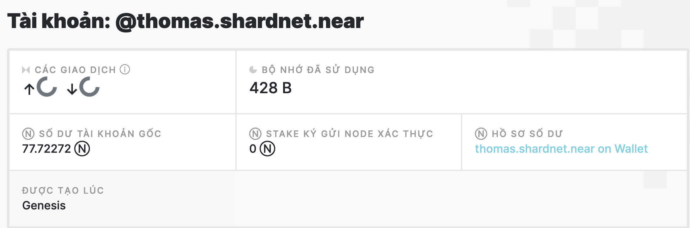
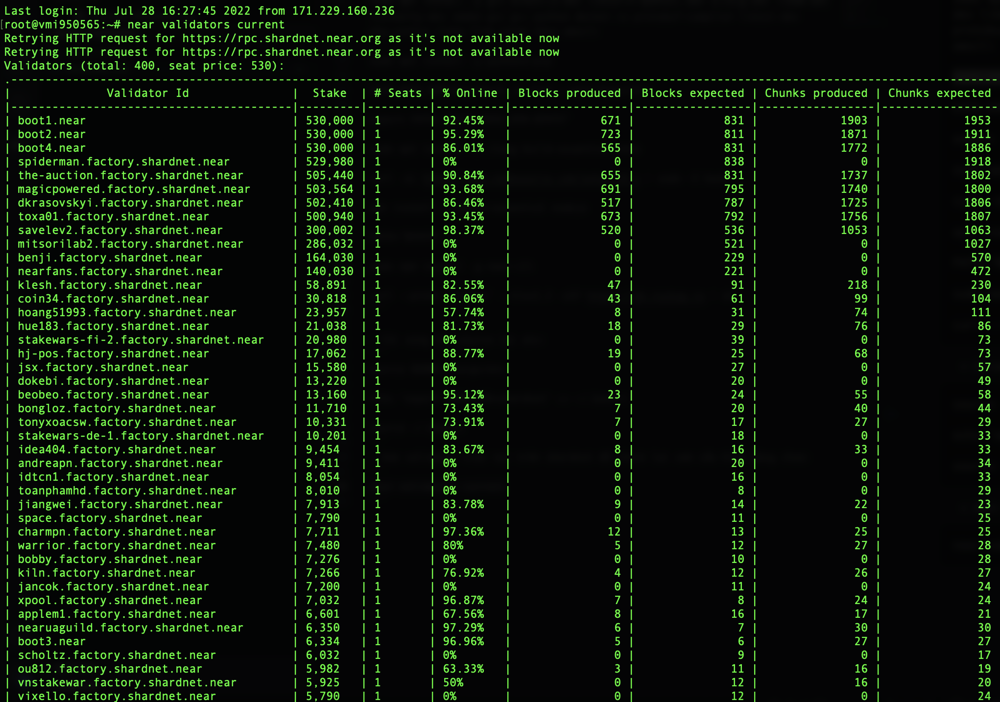
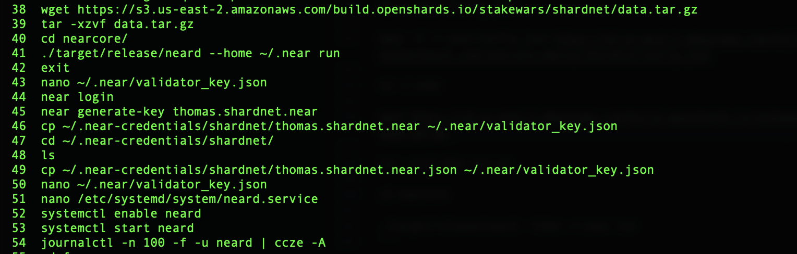
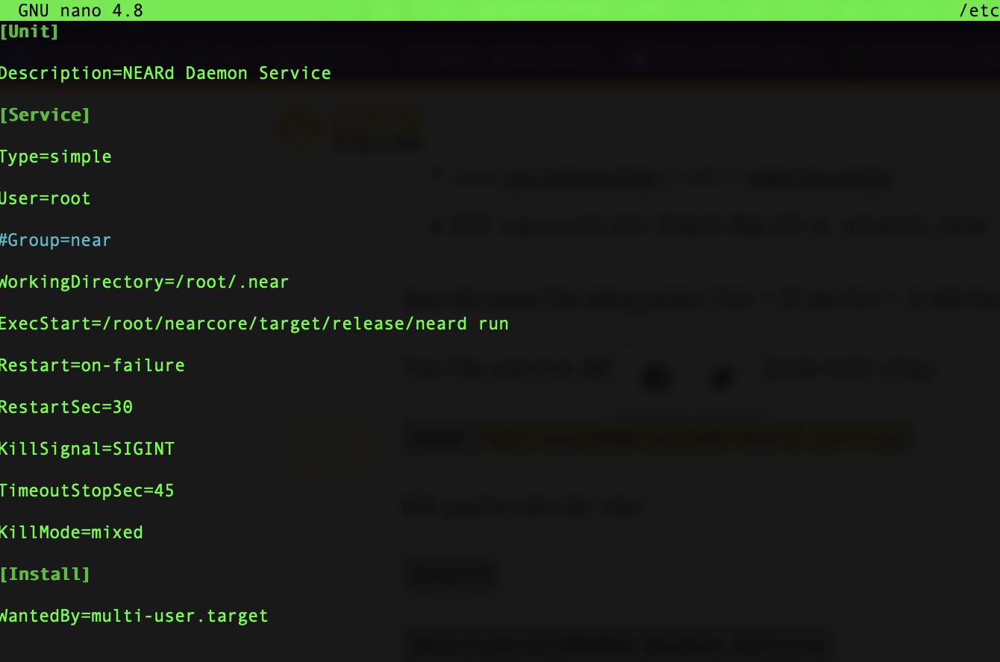
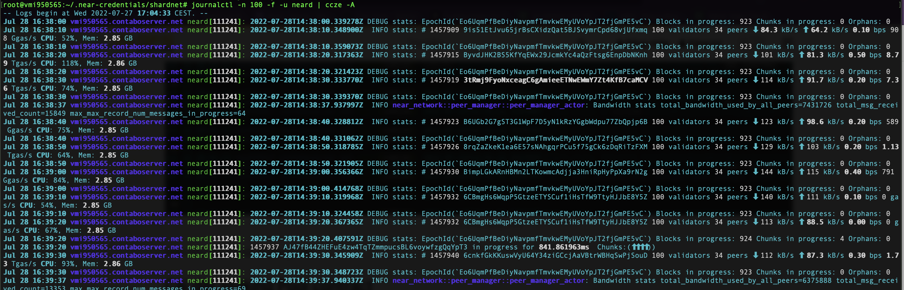
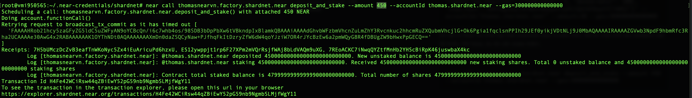

## Stake Wars 3 là gì?

Stake Wars giúp NEAR phi tập trung hơn, nâng số lượng active validator từ 100 lên 300, 400, giảm rào cản phần cứng làm validator xuống, qua đó làm mạng lưới phi tập trung và an toàn hơn!

## Cấu hình máy chủ

Cấu hình node tham gia Stake Wars khá nhẹ:

| Type | Value |
| --- | --- |
| Hardware | Chunk-Only Producer Specifications |
| CPU | 4-Core CPU with AVX support |
| RAM | 8GB DDR4 | 
| Storage | 500GB SSD |

Lựa chọn gói dịch vụ 11.99$ đăng ký tại: https://contabo.com/en/vps/ 


Lựa chọn hệ điều hành Ubuntu


Tiến hành thanh toán, nhận tài khoản IP + SSH password.

## Tạo tài khoản Near

Truy cập link: https://wallet.shardnet.near.org/

Đăng ký tài khoản shardnet với tên **thomas.shardnet.near**, tài khoản nhận được ~570 NEAR test để tham gia mạng lưới.



## Chạy node stakewars 3
Setup

- Login vào VPS
- Check CPU support AVX
```
lscpu | grep -P '(?=.*avx )(?=.*sse4.2 )(?=.*cx16 )(?=.*popcnt )' > /dev/null \
  && echo "Supported" \
  || echo "Not supported"
```  

- Update máy chủ
```
sudo apt update && sudo apt upgrade -y
```
- Cài đặt tools, python, Rust, cargo, copy mỗi dòng một lệnh …  
```
sudo apt install -y git binutils-dev libcurl4-openssl-dev zlib1g-dev libdw-dev libiberty-dev cmake gcc g++ python docker.io protobuf-compiler libssl-dev pkg-config clang llvm cargo tmux awscli

sudo apt install -y python3-pip

USER_BASE_BIN=$(python3 -m site --user-base)/bin

export PATH="$USER_BASE_BIN:$PATH"

sudo apt install -y clang build-essential make

curl -sL https://deb.nodesource.com/setup_18.x | sudo -E bash -  

apt install -y build-essential nodejs

PATH="$PATH"

sudo npm install -g near-cli

curl --proto '=https' --tlsv1.2 -sSf https://sh.rustup.rs | sh
```

- Cài xong thì source lại env:  
```
source $HOME/.cargo/env

echo 'export NEAR_ENV=shardnet' >> ~/.bashrc

source ~/.bashrc
```
- Xem validator hiện tại trên shardnet để check lại xem cấu hình đúng chưa:
```
near validators current
```


## Cài đặt NEARCore
```
git clone https://github.com/near/nearcore

cd nearcore

git fetch

git checkout 0d7f272afabc00f4a076b1c89a70ffc62466efe9
```

Sau đó build NEARCore:

```
cargo build -p neard --release --features shardnet
```

Đợi tầm lúc tầm 10 phút là build xong.

Build xong chạy lệnh này

```
./target/release/neard --home ~/.near init --chain-id shardnet --download-genesis

rm ~/.near/config.json

wget -O ~/.near/config.json https://s3-us-west-1.amazonaws.com/build.nearprotocol.com/nearcore-deploy/shardnet/config.json

cd ~/.near

wget https://s3.us-east-2.amazonaws.com/build.openshards.io/stakewars/shardnet/data.tar.gz  

tar -xzvf data.tar.gz

cd nearcore

./target/release/neard --home ~/.near run
```
Tới bước này thì đợi node sync, 


## Login NEAR
Bật terminal khác để ssh lại vào server, và chạy:
```
near login
```
Copy url, dán vào trình duyệt. Thực hiện quá trình login, chọn xác nhận bằng account id.

Sau đó quay lại terminal và nhập địa chỉ ví shardnet của bạn và ấn enter.

Tiếp đó cấu hình validator key:

```
near generate-key thomas.shardnet.near

cp ~/.near-credentials/shardnet/thomas.shardnet.near.json ~/.near/validator_key.json
```

Sau đó chỉnh sửa lại file validator_key.json:

```
nano ~/.near/validator_key.json
```
màn hình sẽ hiện kiểu này:

```json
{"account_id":thomas.shardnet.near","public_key":"ed25519:**************************************","private_key":"ed25519:*************************************"}
```
Sửa `private_key` thành `secret_key`

Sau đó, lưu nano bằng bấm phím `Command + X`, chọn `Y`

Tạo file service để giữ cho near node luôn chạy
```
nano /etc/systemd/system/neard.service
```
Rồi paste cái này vào:
```
[Unit]

Description=NEARd Daemon Service

[Service]

Type=simple

User=root

#Group=near

WorkingDirectory=/root/.near

ExecStart=/root/nearcore/target/release/neard run

Restart=on-failure

RestartSec=30

KillSignal=SIGINT

TimeoutStopSec=45

KillMode=mixed

[Install]

WantedBy=multi-user.target
```

Sau đó lưu lại và thoát.

Quay lại terminal cũ đang sync hoặc sync xong rồi, bấm `Command + C` để tắt đi đi.

Bật service:
```
systemctl enable neard

systemctl start neard
```

Xem neard đang chạy hay không bằng lệnh này:

```
journalctl -n 100 -f -u neard | ccze -A
```


## Cài đặt Staking Pool contract

Nhập lệnh này:
```
near call factory.shardnet.near create_staking_pool '{"staking_pool_id": "thomasnearvn.shardnet.near", "owner_id": thomas.shardnet.near, "stake_public_key": "<public key>", "reward_fee_fraction": {"numerator": 5, "denominator": 100}, "code_hash":"DD428g9eqLL8fWUxv8QSpVFzyHi1Qd16P8ephYCTmMSZ"}' --accountId="thomas.shardnet.near" --amount=30 --gas=300000000000000
```
Do đã có Near lúc khởi tạo trên shardnet.near ở bước trên.
Để xin một chỗ vào validator cần tối thiểu 165 Near, do đó cần stake thêm.

Chạy lệnh gửi 450 NEAR vào:
```
near call thomasnearvn.shardnet.near deposit_and_stake --amount 450 --accountId thomas.shardnet.near --gas=300000000000000
```


