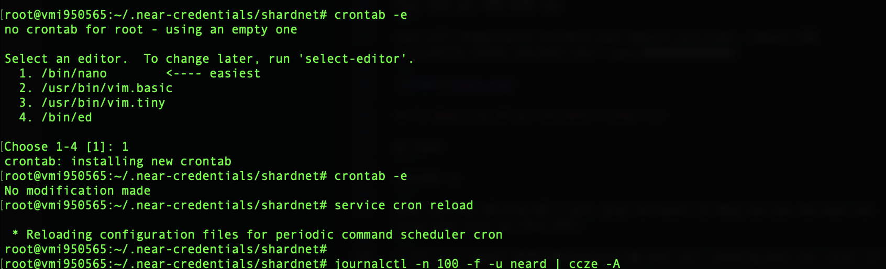
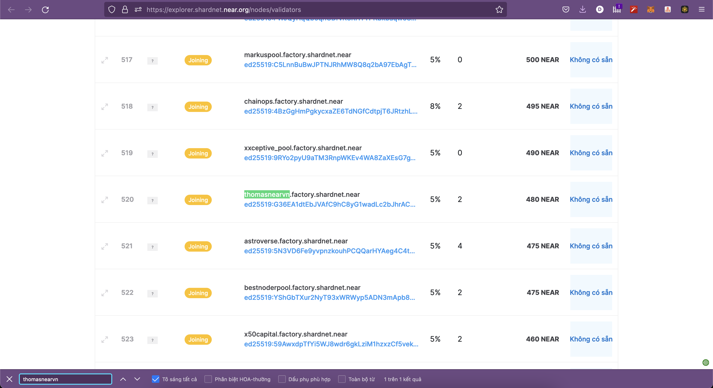
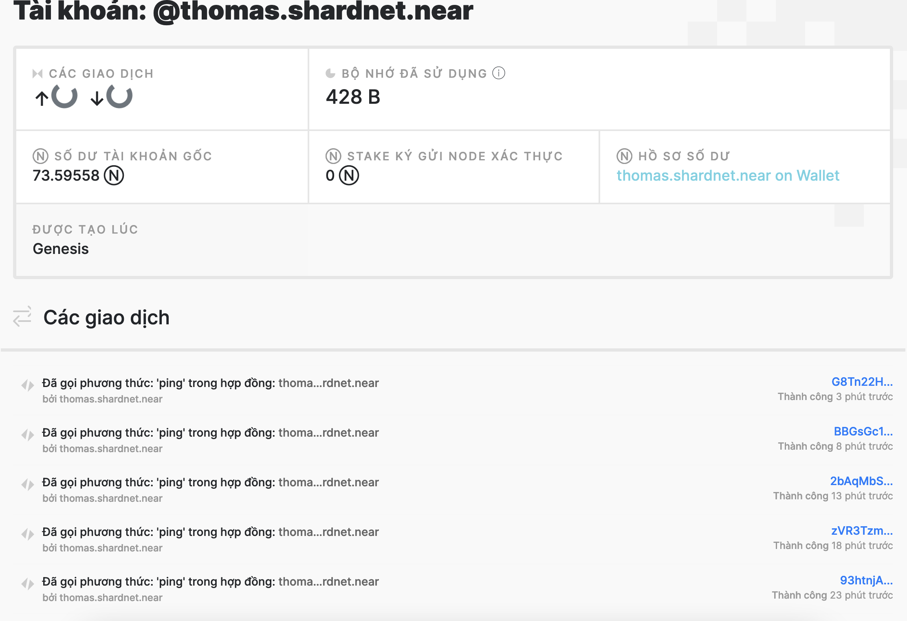

## Tự động ping để giữ validator trong list

Gõ lệnh:
```
crontab -e
```
Nhập lệnh sau để ping mỗi 2 giờ, giúp validator tự động tạo yêu cầu được vào trong danh sách xác thực khối:
```
* */2 * * * export NEAR_ENV=shardnet && near call <staking_pool_id>  ping '{}' --accountId <accountId> --gas=300000000000000
```



Check trên explorer 



